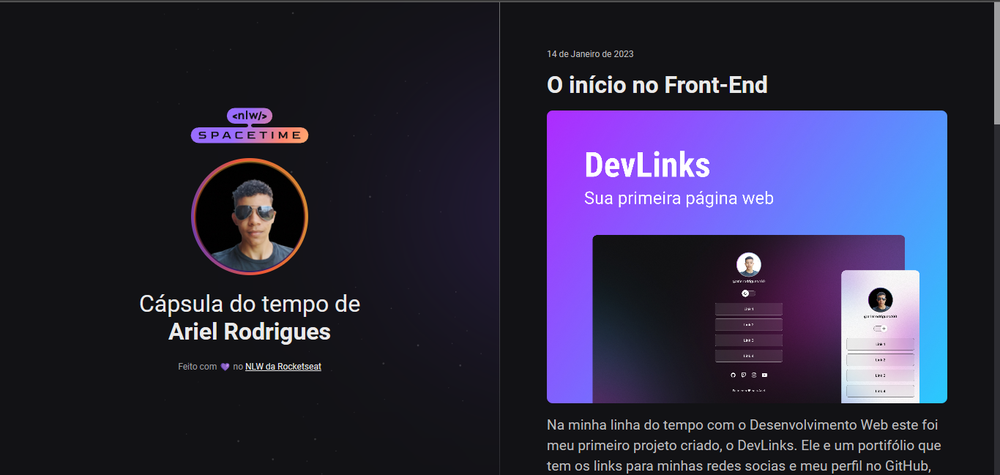

# NLW Spacetime

## 🛠 Tecnologias

- HTML
- CSS
- Git e Github

## 💻 Projeto

Esse foi um projeto desenvolvido pela plataforma Rocketseat, que através de uma semana a proposta era criar um site que mostrasse a Cápsula do tempo de uma pessoa.

## :memo: Licença

Esse projeto está sob a licença MIT.

## ❤️ Contato

@arielrodrigues460